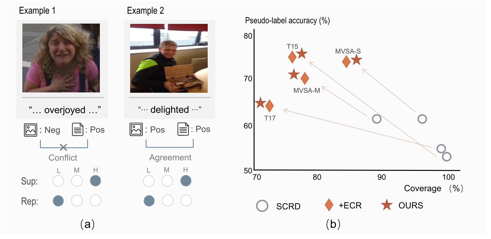
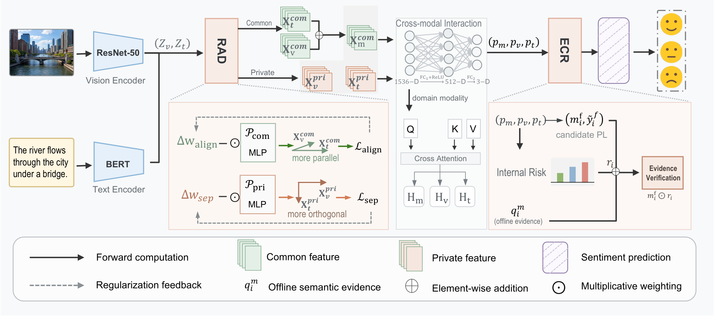
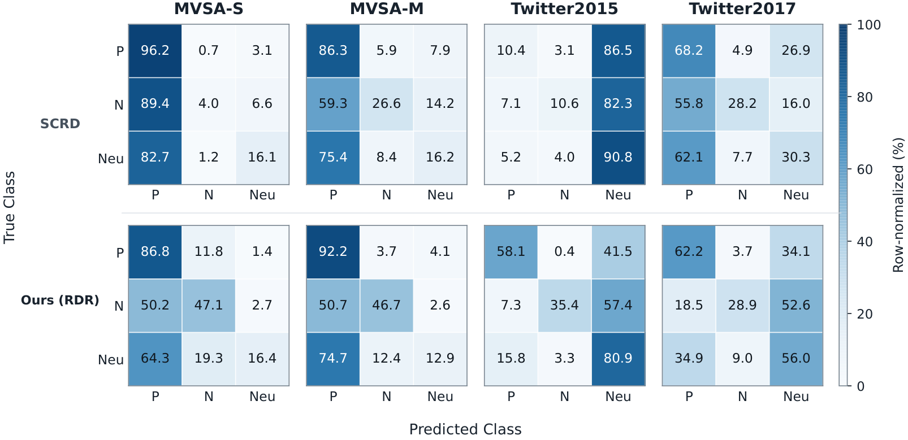

<div align="center">

# Role-Dependent Reliability

### Semi-Supervised Image–Text Sentiment Analysis

[](https://pytorch.org/)
[](https://www.python.org/)


**Zhen Luo · Wenhua Qian**<br>
School of Information Science and Engineering, Yunnan University

</div>

This repository implements **Role-Dependent Reliability (RDR)** for
semi-supervised image–text sentiment analysis. RDR distinguishes two roles of
unlabeled samples: their reliability as pseudo-label supervision and their
utility for cross-modal representation learning.

This is a **lightweight research release** focused on the **MVSA-S dataset with
the nominal 200-label setting**. The datasets, generated MLLM evidence,
checkpoints, and the five experimental split files are not redistributed.

<div align="center">
  
  <br>
  <sub>Supervision reliability and representation utility are not equivalent.</sub>
</div>

## Method

RDR is built on the SCRD backbone and contains two complementary training-time
components:

- **Evidence-Calibrated Reliability (ECR)** combines task-model risk with fixed,
  offline multimodal semantic evidence. It reweights risky pseudo-labels but
  does not replace the task model's prediction.
- **Relation-Adaptive Disentanglement (RAD)** separately estimates cross-modal
  relation trust and representation-refinement demand, then adapts the
  common/private representation objectives.

Both modules are used only during training. Inference retains the SCRD
ResNet-50 and BERT prediction backbone and requires no external MLLM call.

<div align="center">
  
</div>

## MVSA-S results with 200 labels

The main accuracy result is the mean and standard deviation over the five
predefined SCRD splits reported in the manuscript.

| Method | Accuracy (%) | Improvement over SCRD |
|---|---:|---:|
| SCRD | 64.27 ± 0.72 | – |
| **RDR (ECR + RAD)** | **67.15 ± 0.73** | **+2.88** |

The controlled component analysis under the same label budget reports:

| Variant | Accuracy (%) | Macro-F1 (%) | Weighted-F1 (%) |
|---|---:|---:|---:|
| SCRD | 64.27 | 54.18 | 64.20 |
| + ECR | 66.32 | 57.03 | 67.52 |
| **+ ECR + RAD** | **67.15** | **58.24** | **67.67** |

<div align="center">
  
  <br>
  <sub>Row-normalized confusion matrices under the middle label budgets. On
  MVSA-S, negative recall increases from 4.0% to 47.1%.</sub>
</div>

## Release contents

| Item | Included? | Notes |
|---|:---:|---|
| RDR/SCRD training and evaluation code | Yes | `main.py`, `models/`, `datasets/` |
| Qwen3.5-Omni and GLM-4.6V API entry points | Yes | `tools/` |
| Paper figures | Yes | PNG and source PDF files in `assets/` |
| MVSA-S images and text | No | Obtain them under the dataset's terms |
| Paper's fixed MLLM evidence bank | No | Generate a new bank through the provided API tool |
| Five predefined labeled split files | No | Required for split-identical reproduction |
| Pretrained RDR checkpoint | No | Train locally |

Consequently, the current release supports **protocol reproduction**, not an
exact byte-for-byte or split-identical reproduction of the reported number.
Newly generated API evidence may also differ from the fixed evidence bank used
in the paper as hosted models and services change.

## Environment

The paper experiments use PyTorch 2.4.1, CUDA 12.1, and NVIDIA RTX 4090 GPUs.
The compact release was checked with Python 3.8.20 and the versions pinned in
`requirements.txt`.

```bash
conda create -n rdr python=3.8 -y
conda activate rdr

pip install torch==2.4.1 torchvision==0.19.1 \
  --index-url https://download.pytorch.org/whl/cu121
pip install -r requirements.txt
```

Training currently requires an NVIDIA GPU. On first use, Transformers downloads
`bert-base-uncased`; prepare the corresponding local cache in an offline
environment.

## Dataset preparation

MVSA-S is not distributed in this repository. Obtain the processed/relabeled
MVSA data from the
[dataset link used by SCRD](https://pan.baidu.com/s/14HxGf1xwUhuOmGOJAN-iDA?pwd=3yzs)
(access code: `3yzs`) and follow its terms of use.

Expected layout:

```text
/path/to/MVSA-Single/
├── train.json
├── test.json
└── data/
    ├── 1.jpg
    ├── 1.txt
    ├── 2.jpg
    ├── 2.txt
    └── ...
```

`train.json` and `test.json` are JSON objects keyed by sample ID. A minimal
record is:

```json
{
  "1": {
    "label": 0,
    "img_label": 0,
    "text_label": 2
  }
}
```

The loader reads `data/<sample_id>.jpg` and `data/<sample_id>.txt`. A record may
instead contain an `image` filename and an inline `text` field. `img_label` and
`text_label` are optional and default to `label`.

The repository uses `positive = 0`, `negative = 1`, and `neutral = 2`.

### The nominal 200-label setting

Following the SCRD implementation, balanced selection uses 67 samples per
class, so the runnable argument is `--num_labels 201`. In this README, *n=200*
denotes the paper's nominal budget and 201 denotes the implementation count.

If no ID file is supplied, the code samples a balanced labeled subset using
`--seed`. For a fixed fold, create a text file with one `train.json` sample ID
per line and pass it with `--labeled_ids_path`:

```text
splits/mvsa_s_n200/fold0/labeled_ids.txt
```

## Generate offline semantic evidence

The training code never calls an MLLM directly. Generate the tri-view evidence
bank once, save it as JSONL, and then reuse the same file for all matched runs.

### Qwen3.5-Omni used in the paper

```bash
export DATA_ROOT=/path/to/MVSA-Single
export EVIDENCE_FILE=./evidence/mvsa_s_qwen35_omni.jsonl
export DASHSCOPE_API_KEY=your_api_key

python tools/generate_qwen35_omni_tri_sentiment_v2.py \
  --data_dir "$DATA_ROOT/data" \
  --out_file "$EVIDENCE_FILE" \
  --model qwen3.5-omni-plus \
  --overwrite \
  --print_distribution
```

Resume an interrupted generation job with `--resume` instead of `--overwrite`.
The tool also accepts `--api_key_file`; API-key files, `.env` files, evidence,
and outputs are excluded by `.gitignore`.

### Optional GLM-4.6V robustness run

```bash
export ZAI_API_KEY=your_api_key

python tools/generate_glm46v_tri_sentiment_v2.py \
  --data_dir "$DATA_ROOT/data" \
  --out_file ./evidence/mvsa_s_glm46v.jsonl \
  --model glm-4.6v \
  --overwrite
```

These commands send dataset images/text to a third-party API and may incur
costs. Review the dataset license, provider terms, and privacy requirements
before running them. Never commit an API key.

## Train RDR on MVSA-S n=200

The following command exposes the paper's fixed RDR parameters explicitly:

```bash
CUDA_VISIBLE_DEVICES=0 python main.py \
  --dataset mvsa-s \
  --data_dir "$DATA_ROOT" \
  --train_data_dir "$DATA_ROOT" \
  --test_data_dir "$DATA_ROOT" \
  --gpu 0 \
  --save_dir ./outputs/mvsa_s_n200/fold0 \
  --save_name rdr \
  --overwrite \
  --num_labels 201 \
  --num_classes 3 \
  --epoch 500 \
  --num_train_iter 512 \
  --seed 42 \
  --batch_size 2 \
  --uratio 4 \
  --eval_batch_size 128 \
  --num_workers 1 \
  --optim SGD \
  --lr 1e-4 \
  --momentum 0.9 \
  --weight_decay 5e-4 \
  --threshold 0.95 \
  --p_cutoff 0.95 \
  --use_mllm_verification true \
  --mllm_evidence_path "$EVIDENCE_FILE" \
  --mllm_verify_mode mm \
  --mllm_verify_policy risky_only \
  --mllm_action hybrid_cerw \
  --mllm_missing_policy pass \
  --mllm_label_map positive:0,negative:1,neutral:2 \
  --risk_margin_threshold 0.20 \
  --risk_kl_threshold 0.50 \
  --hybrid_support_high 0.65 \
  --hybrid_support_low 0.30 \
  --mllm_ecs_conf_threshold 0.75 \
  --hybrid_qwen_conf_high 0.75 \
  --use_sa_dd true \
  --sa_dd_version v2 \
  --lambda_sa_dd 0.01 \
  --sa_dd_history_momentum 0.90 \
  --sa_dd_min_history_stability 0.60 \
  --sa_dd_min_aug_stability 0.60 \
  --sa_dd_v2_stability_temperature 0.10
```

For a fixed split, append:

```bash
--labeled_ids_path splits/mvsa_s_n200/fold0/labeled_ids.txt
```

The parameter mapping follows the manuscript:
`τ_mar=0.20`, `τ_aug=0.50`, `τ_sup=0.65`, `τ_con=0.30`,
`τ_ext=0.75`, `μ=0.90`, `τ_s=0.60`, `T_s=0.10`, and
`λ_RAD=0.01`. No test-set statistic should be used to tune these values.

To obtain a clean validation-selected local run, add a deterministic validation
split and evaluate the test set only once:

```bash
--val_ratio 0.1 \
--val_seed 42 \
--split_dir splits/mvsa_s_val10_seed42 \
--eval_on_test_final_only true
```

This local validation split is useful for new experiments but is not a
replacement for the paper's five predefined SCRD splits.

## Outputs

The example run writes to `outputs/mvsa_s_n200/fold0/rdr/`. It contains the
training log, `model_best.pth`, evaluation summaries, per-class metrics,
confusion matrices, and pseudo-label diagnostics.

For five-split reporting, repeat the run with all five fixed labeled-ID files
and separate output directories, then report the mean and standard deviation of
the five test accuracies. Preserve the split IDs, evidence-bank checksum, seed,
package versions, GPU, CUDA, and cuDNN versions with each run.

## Citation

The bibliographic venue information will be updated after publication. For the
current manuscript, use:

```bibtex
@misc{luo2026role,
  author = {Luo, Zhen and Qian, Wenhua},
  title  = {Role-Dependent Reliability for Semi-Supervised Image--Text Sentiment Analysis},
  year   = {2026},
  note   = {Manuscript}
}
```

RDR uses SCRD as its backbone. Please also cite the original SCRD paper when
using this repository.

```bibtex
@inproceedings{xia2025seek,
  author    = {Xia, Wuyou and Jia, Guoli and Zhao, Sicheng and Yang, Jufeng},
  title     = {Seek Common Ground While Reserving Differences: Semi-Supervised Image-Text Sentiment Recognition},
  booktitle = {Proceedings of the IEEE/CVF Conference on Computer Vision and Pattern Recognition},
  pages     = {29601--29611},
  year      = {2025}
}
```

## License

Released under the [Apache License 2.0](LICENSE). Dataset and third-party model
licenses remain with their respective owners.
