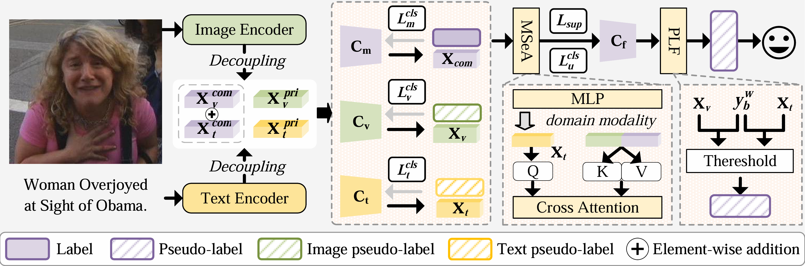

<div align="center">

# Seek Common Ground While Reserving Differences

### Semi-supervised Image-Text Sentiment Recognition

[](https://openaccess.thecvf.com/content/CVPR2025/html/Xia_Seek_Common_Ground_While_Reserving_Differences_Semi-Supervised_Image-Text_Sentiment_Recognition_CVPR_2025_paper.html)
[](https://pytorch.org/)


</div>

This repository contains the official implementation of **SCRD**. This compact
release documents one experiment only: **MVSA-Single (MVSA-S) under the
200-label setting**. Other datasets and label budgets from the paper are outside
the scope of this release.

<div align="center">
  
</div>

## Reported result for this setting

| Dataset | Nominal label budget | Labels used by the code | Metric | Reported result |
|---|---:|---:|---|---:|
| MVSA-S | 200 | 201 (67 per class) | Accuracy (%) | 64.27 +/- 0.72 |

The paper names this setting **200 labels**. Because MVSA-S has three classes
and the implementation uses class-balanced sampling, the runnable setting uses
`201 = 67 x 3` labeled training samples. Throughout this README, **n=200**
denotes the paper's nominal setting and `--num_labels 201` denotes its actual
implementation.

## Environment

The current code imports successfully and exposes the documented command-line
arguments in the following environment:

- Linux with an NVIDIA GPU and CUDA 12.1
- Python 3.8.20
- PyTorch 2.4.1 and torchvision 0.19.1
- transformers 4.40.2
- NumPy 1.24.4, pandas 2.0.3, scikit-learn 1.3.2
- Pillow 10.4.0, tensorboardX 2.6.2.2, PyYAML 6.0.3, tqdm 4.70.0

One possible installation is:

```bash
conda create -n scrd python=3.8 -y
conda activate scrd

pip install torch==2.4.1 torchvision==0.19.1 \
  --index-url https://download.pytorch.org/whl/cu121
pip install transformers==4.40.2 numpy==1.24.4 pandas==2.0.3 \
  scikit-learn==1.3.2 pillow==10.4.0 tensorboardX==2.6.2.2 \
  PyYAML==6.0.3 tqdm==4.70.0
```

The first run downloads the pretrained `bert-base-uncased` and ResNet-18
weights. In an offline environment, download them in advance and make them
available through the corresponding Hugging Face and PyTorch caches.

## Dataset preparation

The MVSA-S images and texts are **not distributed in this repository**. Please
obtain the relabeled MVSA data from the
[dataset link used by the original project](https://pan.baidu.com/s/14HxGf1xwUhuOmGOJAN-iDA?pwd=3yzs)
(access code: `3yzs`) and comply with the dataset's terms of use.

Place the files outside the Git repository, for example:

```text
/path/to/MVSA-Single/
├── train.json
├── test.json
└── data/
    ├── 1.jpg
    ├── 1.txt
    ├── 2.jpg
    ├── 2.txt
    └── ...
```

`train.json` and `test.json` must each be a JSON object keyed by sample ID. A
minimal record is:

```json
{
  "1": {
    "label": 0,
    "img_label": 0,
    "text_label": 2
  }
}
```

The loader reads the image from `data/<sample_id>.jpg` and the text from
`data/<sample_id>.txt`. Alternatively, a record may contain an `image` filename
and a `text` string directly. `img_label` and `text_label` are optional for
training; when omitted, they default to `label`.

The label mapping used in this repository is:

| ID | Sentiment |
|---:|---|
| 0 | positive |
| 1 | negative |
| 2 | neutral |

Before training, check that both annotation files and the referenced image/text
files are present. Sample IDs must be unique, and IDs used by a labeled split
must occur in `train.json`.

## Run the MVSA-S n=200 experiment

Set `DATA_ROOT` to the absolute dataset directory and run from the repository
root:

```bash
export DATA_ROOT=/path/to/MVSA-Single

CUDA_VISIBLE_DEVICES=0 python main.py \
  --dataset mvsa-s \
  --data_dir "$DATA_ROOT" \
  --train_data_dir "$DATA_ROOT" \
  --test_data_dir "$DATA_ROOT" \
  --gpu 0 \
  --save_dir ./outputs/mvsa_s_n200/seed42 \
  --save_name main \
  --overwrite \
  --num_labels 201 \
  --num_classes 3 \
  --epoch 200 \
  --num_train_iter 512 \
  --seed 42 \
  --batch_size 2 \
  --uratio 4 \
  --eval_batch_size 128 \
  --num_workers 1 \
  --lr 1e-4 \
  --optim SGD \
  --momentum 0.9 \
  --weight_decay 5e-4 \
  --threshold 0.95 \
  --p_cutoff 0.95 \
  --ulb_loss_ratio 1.0 \
  --lam_c 3 \
  --lam_d 3 \
  --use_mllm_verification 0
```

If `--labeled_ids_path` is omitted, the code samples 67 labeled examples from
each class using `--seed` and stores the sampled indices with the run outputs.
This command reproduces the **training protocol**, but a newly sampled subset
is not guaranteed to reproduce the exact reported five-fold number.

### Exact labeled split

For an exact run, provide the labeled sample IDs used by that fold:

```text
splits/mvsa_s_n200/fold0/labeled_ids.txt
```

The file contains one `train.json` sample ID per line and 201 non-empty lines in
total. Add the following argument to the command above:

```bash
--labeled_ids_path splits/mvsa_s_n200/fold0/labeled_ids.txt
```

For five-fold evaluation, repeat the run with the five fixed ID lists and use a
different output directory for every fold. Report the mean and variation of the
five test accuracies. The fixed ID lists are small metadata files and do not
contain images or text, so they should be published with the code whenever the
dataset license permits. Without the original five ID lists, the experiment is
**protocol-reproducible but not split-identical**.

## Outputs

For the command above, outputs are written to:

```text
outputs/mvsa_s_n200/seed42/main/
```

The directory contains the training log, the sampled-label indices, and
`model_best.pth`. Evaluation logs report top-1 accuracy, macro-F1, weighted-F1,
per-class precision/recall/F1, and the confusion matrix.

## Notes on reproducibility

- Keep `train.json` and `test.json` unchanged; JSON membership and insertion
  order affect sample indexing.
- Record the labeled ID list, random seed, package versions, GPU model, and CUDA
  version for each run.
- Small numerical differences across CUDA, cuDNN, GPU, and PyTorch versions are
  expected even when deterministic seeds are enabled.
- Do not commit the MVSA-S images or texts unless their license explicitly
  permits redistribution.

## Citation

If this code is useful in your research, please cite:

```bibtex
@inproceedings{xia2025seek,
  author    = {Xia, Wuyou and Jia, Guoli and Zhao, Sicheng and Yang, Jufeng},
  title     = {Seek Common Ground While Reserving Differences: Semi-Supervised Image-Text Sentiment Recognition},
  booktitle = {Proceedings of the IEEE/CVF Conference on Computer Vision and Pattern Recognition (CVPR)},
  pages     = {29601--29611},
  year      = {2025}
}
```

## License

This project is released under the [Apache License 2.0](./LICENSE).
